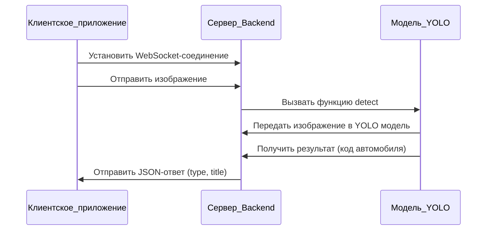

# Описания проекта:

1. **Backend**:
   - **Система детектирования автомобиля**: Отвечает за распознавание автомобилей на изображениях с использованием модели YOLO.
   - **Вопросно-ответные системы**: Обрабатывает вопросы и предоставляет ответы с использованием NLP (Natural Language Processing).
   - **FastAPI (Внешний интерфейс)**: Служит внешним интерфейсом для взаимодействия с мобильным приложением и другими клиентами. Использует WebSocket для потоковой передачи данных.

2. **Mobile**:
   - **Работа с камерой**: Обрабатывает захват изображений с камеры устройства.
   - **Трекинг точек**: Отслеживает движение точек на изображении (например, для AR-приложений).
   - **Отображение 3D**: Отвечает за отображение 3D-моделей и графики.
   - **Работа с запросами**: Управляет отправкой и приемом запросов к серверу через WebSocket.

### Взаимодействие компонентов:
- **Система детектирования автомобиля** и **Вопросно-ответные системы** взаимодействуют с **FastAPI** для обработки запросов.
- **Работа с запросами** на мобильной стороне взаимодействует с **FastAPI** через WebSocket.
- **Работа с камерой**, **Трекинг точек** и **Отображение 3D** взаимодействуют с **Работой с запросами** для отправки и приема данных.

### Подробное описание связей:
- **Система детектирования автомобиля** использует модель YOLO для распознавания автомобилей.
- **Вопросно-ответные системы** используют NLP для обработки запросов и генерации ответов.
- **FastAPI** работает с WebSocket для обмена данными с мобильным приложением.
- **Работа с запросами** на мобильной стороне также использует WebSocket для обмена данными с сервером.
- **Работа с камерой** использует встроенные камеры устройства для захвата изображений.
- **Трекинг точек** использует OpenCV для фиксации на объекте для отображения 3D-графики.
- **Отображение 3D** использует 3D-движок для рендеринга 3D-графики.

## Backend

Backend представляет собой код, работающий на сервере, и предназначен для выполнения задач по определению объектов на изображениях. Эта система позволяет эффективно различать и идентифицировать объекты, такие как автомобили, на изображениях. Для обеспечения потоковой передачи данных между клиентской частью приложения и сервером используется соединение по протоколу WebSocket. Это позволяет клиентской части отправлять изображения на сервер, а сервер, в свою очередь, отвечает сообщением в формате JSON. В этом JSON-сообщении содержится поле `type`, которое включает код модели автомобиля, например, `UAZ` для УАЗ или `LAC` для LADA Classic (Лада Классик), а также поле `title`, содержащее человекочитаемое название автомобиля, например, «Буханка» или «Жигули».

Для корректной работы этой системы используется модуль YOLO (You Only Look Once). YOLO — это предобученная модель, специализированная на распознавании объектов. Этот модуль находится в отдельном файле и интегрируется в систему. В системе также используется фреймворк FastAPI, который управляет API-интерфейсом. При получении изображения от клиента, FastAPI вызывает функцию `detect`, передавая ей изображение в бинарном формате. Функция `detect` использует модель YOLO для распознавания автомобиля на изображении и возвращает код автомобиля, который затем передается обратно клиенту в формате JSON.

### Описание диаграммы:

1. **Клиентское приложение**:
   - Устанавливает WebSocket-соединение с сервером.
   - Отправляет изображение на сервер.

2. **Сервер (Backend)**:
   - Получает изображение от клиента.
   - Вызывает функцию `detect` в модуле YOLO, передавая ей изображение в бинарном формате.
   - Получает результат от модели YOLO.
   - Формирует и отправляет JSON-ответ клиенту, содержащий поля `type` (код автомобиля) и `title` (человекочитаемое название автомобиля).

3. **Модель YOLO**:
   - Принимает изображение в бинарном формате.
   - Распознает автомобиль на изображении.
   - Возвращает код автомобиля.

