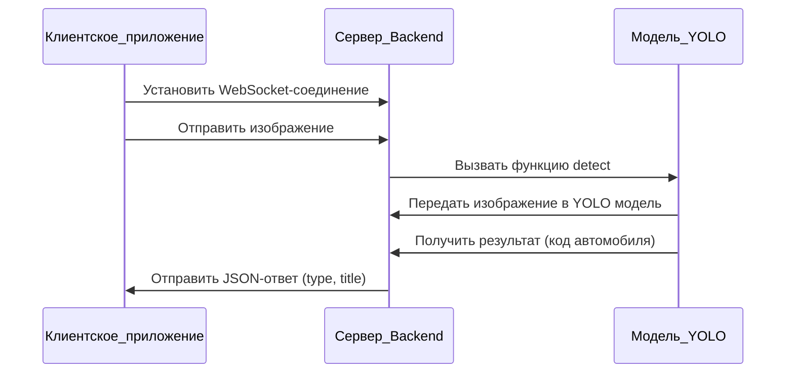

## Backend

Backend представляет собой код, работающий на сервере, и предназначен для выполнения задач по определению объектов на изображениях. Эта система позволяет эффективно различать и идентифицировать объекты, такие как автомобили, на изображениях. Для обеспечения потоковой передачи данных между клиентской частью приложения и сервером используется соединение по протоколу WebSocket. Это позволяет клиентской части отправлять изображения на сервер, а сервер, в свою очередь, отвечает сообщением в формате JSON. В этом JSON-сообщении содержится поле `type`, которое включает код модели автомобиля, например, `UAZ` для УАЗ или `LAC` для LADA Classic (Лада Классик), а также поле `title`, содержащее человекочитаемое название автомобиля, например, «Буханка» или «Жигули».

Для корректной работы этой системы используется модуль YOLO (You Only Look Once). YOLO — это предобученная модель, специализированная на распознавании объектов. Этот модуль находится в отдельном файле и интегрируется в систему. В системе также используется фреймворк FastAPI, который управляет API-интерфейсом. При получении изображения от клиента, FastAPI вызывает функцию `detect`, передавая ей изображение в бинарном формате. Функция `detect` использует модель YOLO для распознавания автомобиля на изображении и возвращает код автомобиля, который затем передается обратно клиенту в формате JSON.

### Описание диаграммы:

1. **Клиентское приложение**:
   - Устанавливает WebSocket-соединение с сервером.
   - Отправляет изображение на сервер.

2. **Сервер (Backend)**:
   - Получает изображение от клиента.
   - Вызывает функцию `detect` в модуле YOLO, передавая ей изображение в бинарном формате.
   - Получает результат от модели YOLO.
   - Формирует и отправляет JSON-ответ клиенту, содержащий поля `type` (код автомобиля) и `title` (человекочитаемое название автомобиля).

3. **Модель YOLO**:
   - Принимает изображение в бинарном формате.
   - Распознает автомобиль на изображении.
   - Возвращает код автомобиля.